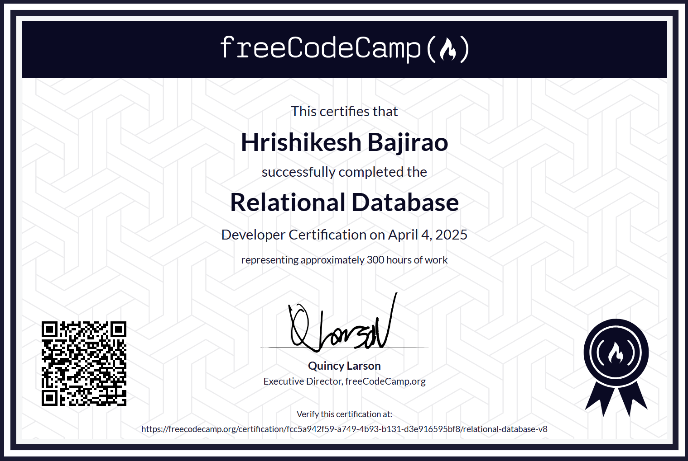

# freeCodeCamp - Pelational Database Certification

## Certification Projects

1. [Celestial Bodies Database](https://github.com/HrishikeshBajirao/freeCodeCamp-Relational-Database/tree/main/CERTIFICATION%20-%20Celestial%20Bodies%20Database)
2. [World Cup Database](https://github.com/HrishikeshBajirao/freeCodeCamp-Relational-Database/tree/main/CERTIFICATION%20-%20World%20cup%20database)
3. [Salon Apppointment Scheduler](https://github.com/HrishikeshBajirao/freeCodeCamp-Relational-Database/tree/main/CERTIFICATION%20-%20Salon%20Appointment%20Scheduler)
4. [Periodic Table Database](https://github.com/HrishikeshBajirao/freeCodeCamp-Relational-Database/tree/main/CERTIFICATION%20-%20Periodic%20Table%20database)
5. [Number Guessing Game](https://github.com/HrishikeshBajirao/freeCodeCamp-Relational-Database/tree/main/CERTIFICATION%20-%20Number%20Guessing%20Game)
